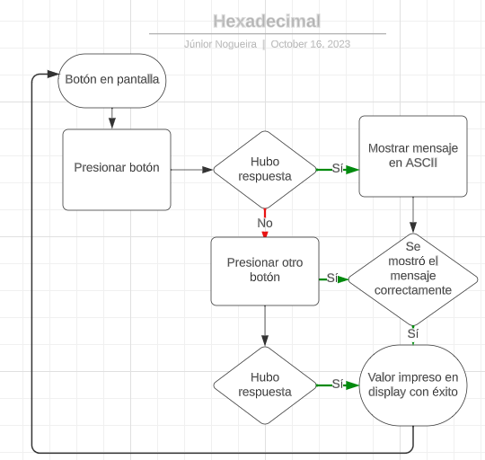

# Conversor de Mensajes en Hexadecimal a ASCII

# Introducción:

Este proyecto, "Conversor de Mensajes en Hexadecimal a ASCII," fue desarrollado para abordar el desafío de convertir mensajes en formato hexadecimal a caracteres ASCII legibles. Aunque en su versión actual el código no sigue todas las mejores prácticas y se mantienen algunos comentarios en español para facilitar la comprensión general del proyecto, es un paso inicial que satisface los requisitos esenciales.

# Simulación de Controlador:

Para emular el controlador de este conversor, se utilizó la biblioteca Socket.io. Aunque los datos están codificados de manera fija en la aplicación, su estructura permite una fácil transición a una base de datos real. Esta adaptación le permitiría a la aplicación consumir y procesar datos, verificar estados o propiedades proporcionados por el backend, y, en última instancia, mejorar la experiencia del usuario.

# Estilo Básico:

Se aplicó un estilo básico a la interfaz para facilitar la navegación y comprensión del proyecto. Esta elección también se hizo para centrarse en la funcionalidad del conversor y no distraerse con cuestiones de diseño complejas.

# Potencial de Implementación de Redux:

En su estado actual, la aplicación no utiliza Redux. Sin embargo, con el tiempo, una posible mejora podría ser la implementación de Redux para un mejor manejo de los componentes y un ahorro significativo de código. Esto se lograría al permitir el acceso a los valores almacenados en el Store de Redux.

# Dinámica del Proyecto:

El objetivo principal de este proyecto es recibir una palabra en formato hexadecimal y trabajar con sus comandos de visualización y respuestas a mensajes recibidos. El resultado es la presentación de la palabra convertida en caracteres ASCII legibles.

# Importancia de Eventos y Estados:

El proyecto hace un uso extensivo de eventos y estados para garantizar una respuesta rápida en la renderización de elementos y la modificación dinámica del DOM. Esta característica es esencial para lograr una experiencia de usuario fluida.

# Falta de Pruebas Unitarias:

También es importante destacar que debido a la falta de tiempo, no se realizaron pruebas unitarias en el proyecto. La inclusión de pruebas unitarias sería altamente beneficiosa para brindar una mayor seguridad y estabilidad a la aplicación, lo que representa una oportunidad de mejora significativa.

# Deployment:

La aplicación se encuentra alojada en un servidor gratuito, lo que significa que si el servidor estuviera caído en algún momento, los usuarios pueden descargar la aplicación en su entorno local. Basta con ejecutar los comandos "npm i" y "npm start" para ponerla en funcionamiento.

Aunque esta versión del proyecto representa un punto de partida sólido, existe un gran potencial para futuras mejoras y expansiones. Las capacidades de la aplicación pueden crecer significativamente mediante la implementación de una base de datos en tiempo real, la optimización del código, la integración de tecnologías avanzadas como Redux y la adición de pruebas unitarias.

Este proyecto representa un punto de partida emocionante y puede ser una base sólida para futuros desarrollos y mejoras.

# La aplicación admite la capacidad de abrir dos ventanas diferentes o utilizar dos dispositivos distintos para observar en tiempo real los eventos y mensajes enviados o recibidos por otros usuarios. Además, como parte de futuras mejoras, se considera la implementación de un sistema de manejo de estados que permitirá una interfaz más atractiva, mostrando información sobre el remitente y el destinatario en la pantalla.

Diagrama de flujo

Diseño del Programa:

Interfaz de Usuario (UI):

Componente de Entrada de Datos: Este componente permite a los usuarios ingresar una palabra en formato hexadecimal para su conversión.
Selector de Comandos: Aquí, los usuarios pueden seleccionar el comando de visualización de mensaje.
Botón de Conversión: Un botón que activa el proceso de conversión de hexadecimal a ASCII.
Resultado de Conversión: Donde se muestra la palabra convertida en ASCII.
Lista de Mensajes: Un área donde se muestran los mensajes relacionados con la conversión.
Lógica de Conversión:

Función de Conversión: Realiza la conversión de una palabra en formato hexadecimal a ASCII. Esta función es disparada por el botón de conversión.
Simulación de Controlador:

Socket.io Connection: Se encarga de la simulación del controlador mediante la comunicación con el servidor a través de Socket.io.
Manejo de Eventos: Escucha y maneja eventos de respuesta del servidor para simular la interacción con el controlador.

Gestión de Estados:

Estado de Conversión: Simula el control del estado de la conversión actual y su resultado.
Estado de Comandos: Simula la administración del comando seleccionado por el usuario.
Estado de Respuesta: Simula el almacenamiento la respuesta del servidor.

El usuario ingresa una palabra en formato hexadecimal y selecciona un comando de visualización.
Al hacer clic en el botón de conversión, se dispara la función de conversión que convierte la palabra y muestra el resultado en la interfaz.
Al mismo tiempo, se inicia la simulación del controlador a través de Socket.io, que se comunica con el servidor.
Cuando el servidor responde, el estado de respuesta se actualiza, y el mensaje se muestra en la interfaz en la lista de mensajes.
Ten en cuenta que este es un diseño básico del programa. Si deseas representar este diseño visualmente, puedes utilizar herramientas de diagramación como Lucidchart o Draw.io. Cada componente interactúa con los demás para lograr la funcionalidad de tu aplicación.

Diagrama de Despliegue:

El diagrama de despliegue distribuye la aplicación en diferentes entornos. En el servidor socket.io y en máquina local. El servidor gratuito donde se despliega la aplicación, así como los clientes o usuarios que acceden a ella. Los usuarios pueden acceder a la aplicación desde sus navegadores o dispositivos.
